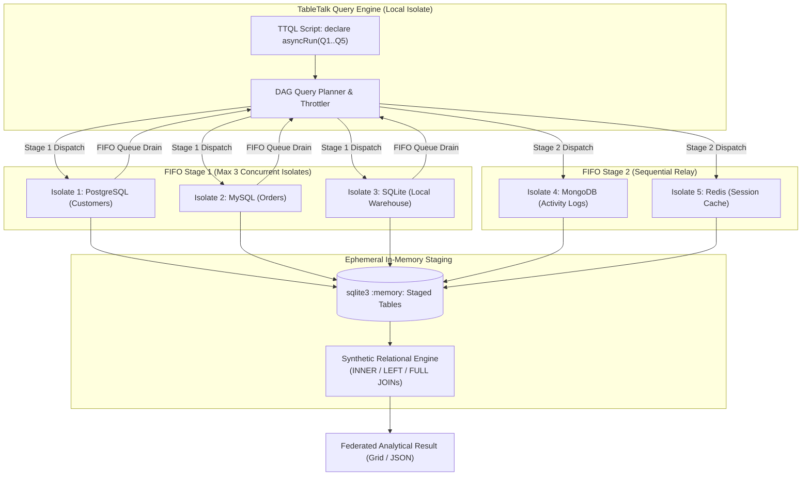
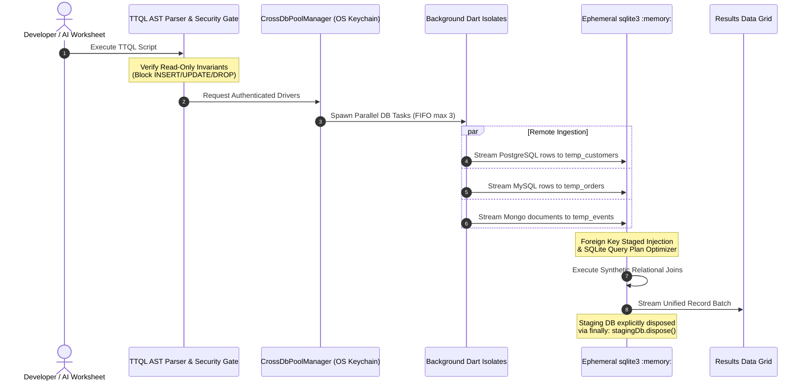
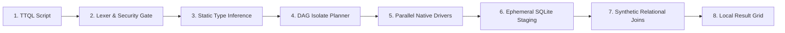

# Overview & Architecture

## The Cross-Database Federation Dilemma

In production software engineering, application state rarely lives in a single database engine. Architectures typically distribute workloads across specialized storage technologies:

| Engine | Typical Production Role |
| :--- | :--- |
| **PostgreSQL** | Primary user accounts, multi-tenant relational models, transactional data |
| **MySQL** | E-commerce transactions, legacy operational stores |
| **MongoDB** | Unstructured event streams, activity logs, dynamic document payloads |
| **Redis** | In-memory session states, distributed locks, ephemeral cache tokens |
| **SQLite** | Local embedded storage, desktop client state, offline caches |

### The Common Approaches

When developers need to correlate data across these disparate stores (e.g., verifying whether an operational event in MongoDB matches a paid customer in PostgreSQL), the typical solutions carry clear operational trade-offs:

1. **Ad-hoc scripts:** Writing Python, Node.js, or Go scripts that fetch records over the network into application memory. These scripts often lack query optimization, handle pagination inconsistently, and expose credentials in source code.
2. **Cloud data warehouses:** Standing up ETL/ELT pipelines to extract, transform, and load data into remote warehouses (Snowflake, BigQuery, ClickHouse). While effective for large-scale analytical reporting, warehouses introduce ingestion latency, recurring cloud costs, and data-egress security compliance hurdles for routine developer workflows.

---

## The TTQL Approach

**TableTalk Query Language (TTQL)** is a declarative domain-specific language designed for local, cross-database analytical queries. Instead of managing ETL infrastructure for routine queries, developers can express queries across multiple database engines in a single script.

TTQL executes data retrieval in parallel background isolates and stages intermediate results into an ephemeral, in-memory SQLite database (`sqlite3.openInMemory()`) on the local workstation. Relational joins and final filtering occur directly in local memory.

```
[TTQL Script] ──► [Lexer & Security Gate] ──► [DAG Query Planner] ──► [Parallel Isolates (≤3)]
                                                                               │
                                                                               ▼
[Local Result Grid] ◄── [Synthetic Relational Joins] ◄── [Ephemeral SQLite :memory:]
```

### Core Architectural Invariants

- **100% Read-Only Safety Gate:** All write operations (`INSERT`, `UPDATE`, `DELETE`, `DROP`, `ALTER`, etc.) are rejected during lexical analysis and parsing. The engine refuses to generate or dispatch mutating commands.
- **OS Keychain Credential Airgap:** Query scripts never contain raw passwords or connection strings. Queries reference abstract pool aliases (e.g. `environment.connections.pg_main`), and TableTalk resolves credentials on demand via operating system keychains (Windows DPAPI, macOS Keychain, Linux Secret Service).
- **FIFO DAG Concurrency Throttling:** To protect production databases from connection exhaustion, parallel query batches declaring more than 3 simultaneous evaluations are partitioned into sequential stages of at most 3 concurrent isolate queries.
- **Deterministic Resource Disposal:** Staging tables exist exclusively in ephemeral memory and are disposed immediately upon query completion via a guaranteed `finally` block (`stagingDb.dispose()`).

---

## Architecture Diagrams

### FIFO Thread Throttling & Isolate Scheduling

When a query declares multiple simultaneous evaluations in `declare asyncRun`, the DAG planner partitions isolate dispatch into sequential batches of at most 3 concurrent threads:



### Ephemeral SQLite :memory: Staging Lifecycle

Intermediate datasets stream into ephemeral C-memory tables where synthetic relational indexes and foreign key linkages are created dynamically:



---

## 8-Stage Execution Pipeline

From raw functional script to tabular result grid:



---

## Pragmatic Design Trade-Offs

To maintain predictable behavior, TTQL is deliberately scoped around the following trade-offs:

1. **Designed for Working Sets, Not Petabyte Warehousing:** Ephemeral staging uses your local workstation's RAM. It is optimized for query result sets ranging from tens of rows to tens of thousands of rows. For bulk analytical workloads scanning billions of rows, dedicated data warehouses remain the correct tool.
2. **Read-Only Scope:** TTQL does not execute cross-database transactions (`2PC`) or multi-source writes. It is strictly an analytical and diagnostic querying tool.
3. **Safe Concurrency Bounds:** By enforcing a strict ceiling of 3 concurrent worker isolates per batch, TTQL prioritizes database stability over raw saturated network throughput.

